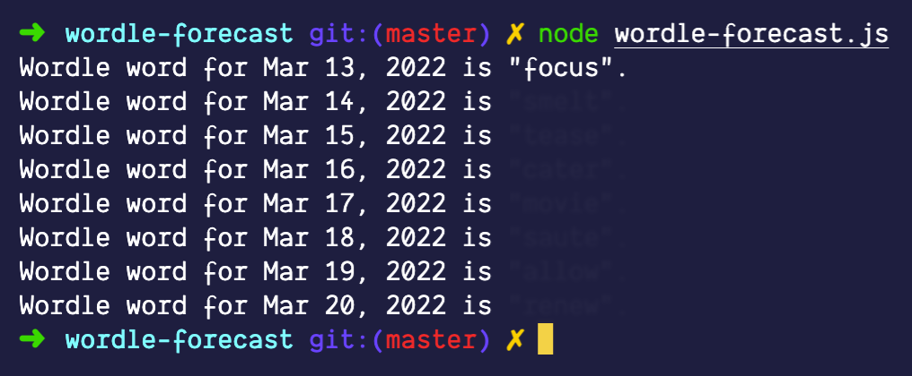

# Wordle Forecast

**IMPORTANT**: All code here originates from [Wordle](https://www.nytimes.com/games/wordle/index.html). I merely replicated the code by inspecting the source code from the actual NYT website.

The purpose of this repository is to show that **client-side code is always public code**. I do not claim any rights to this code. Wordle is awesome.



## How to use

Easy. Just clone this repository and run:

```sh
node wordle-forecast.js
```

and the program will log the next week's worth of word solutions for you.
